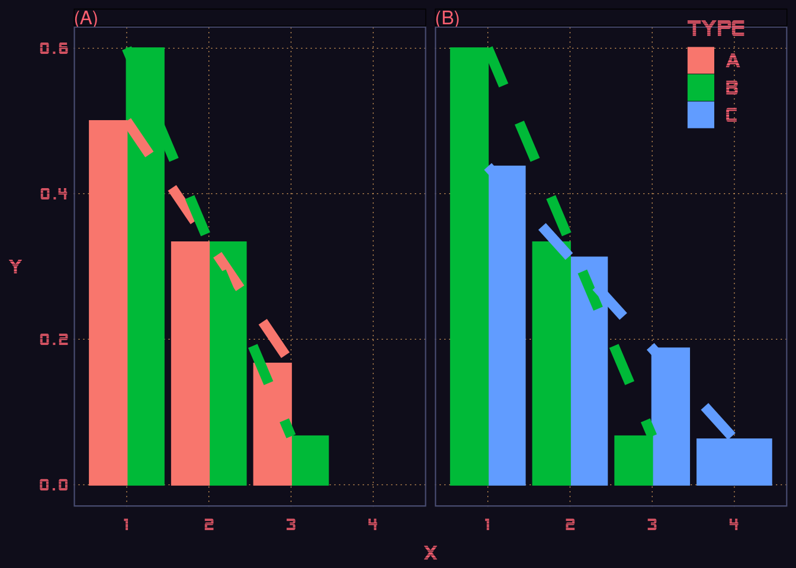
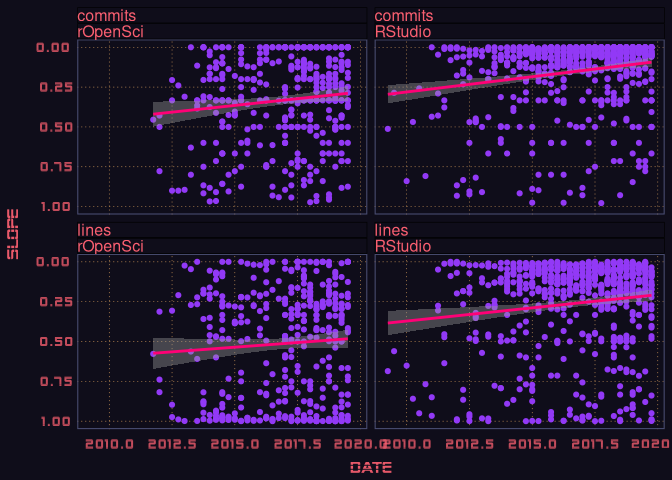

A response to the [call for
help](https://github.com/ropenscilabs/annual-report-help) contributing
to the rOpenSci 2019 Annual Report, via [issue
\#4](https://github.com/ropenscilabs/annual-report-help/issues/4), which
aimed to quantify “Number of authors per package”. From the original
description by [@sckott](https://github.com/sckott):

> Does the number of maintainers per package change through time?

> In the interest of software sustainability, ideally each package would
> have more than one maintainer, but this is relatively rare. We’d like
> to see the number of maintainers per package increase over time, but
> number of maintainers is hard to address without detailed knowledge of
> each repo. As a proxy, we could count up all authors regardless of
> their role (not counting reviewers, funders).

> Question becomes: Does the number of authors per package change
> (increase) through time?

Suggested approaches were based on extracting “official” authors from
package DESCRIPTION files, but numbers of authors in this context are
unavoidably cumulative, and must increase across time because authors
are very generally *not* ever removed once added. Addressing the issue
through official DESCRIPTION files would thus require comparison of
these rates of increase with some kind of neutral, expected value, which
seems impracticable, so alternative approaches are pursued here.

The analyses mostly work via several functions defined in
`function-defs.R`, loaded here, along with necessary libraries.

``` r
library (jsonlite)
library (dplyr)
library (magrittr)
library (ggplot2)
source ("function-defs.R")
```

The functions mostly use the github graphql API to extract the full
commit histories of all rOpenSci package repos. Not all of these are
directly hosted on `github/ropensci`, and so github organisation names
also need to be extracted.

``` r
x <- fromJSON("https://raw.githubusercontent.com/ropensci/roregistry/gh-pages/registry.json")
pkg_names <- filter(x$packages, on_cran) %>% .$name
urls <- filter(x$packages, on_cran) %>% .$github
urls <- gsub ("https://github.com/", "", urls)
orgs <- vapply (urls, function (i) strsplit (i, "/") [[1]] [1], character (1))
repos <- vapply (urls, function (i) strsplit (i, "/") [[1]] [2], character (1))
names (orgs) <- names (repos) <- repos
```

That produces two vectors of `orgs` and `repos`, so each rOpenSci
package can be identified on github via `org/repo`. The extraction from
the github graphql API requires a client to be established with the
following code:

``` r
token <- Sys.getenv("GITHUB_GRAPHQL_TOKEN") # or whatever
gh_cli <- ghql::GraphqlClient$new (
    url = "https://api.github.com/graphql",
    headers = httr::add_headers (Authorization = paste0 ("Bearer ", token))
)
```

## Get commit history from github

Extracting all of the commit histories takes about 20 min or so to run:

``` r
get_all_commits <- function (gh_cli)
{
    st0 <- Sys.time ()
    lapply (seq (repos), function (i) {
                   res <- process_commit_history (gh_cli, orgs [i], repos [i])
                   st <- difftime (Sys.time (), st0, units = "s") / i
                   # st is time per repo to that point
                   st <- hms::as_hms (round (st * (length (repos) - i)))
                   message (repos [i], ": ", i, " / ", length (repos),
                            "; estimated time left = ", st)
                   saveRDS (res, "results.Rds")
                   return (res)
       })
}
system.time (
             res <- get_all_commits (gh_cli)
             )
names (res) <- repos
saveRDS (res, "results.Rds")
```

## Analyse increases in numbers of contributors over time

In lieu of analysing official authors, which is untenable for reasons
explained above, the following code analyses contributions in terms both
of numbers of commits and numbers of lines of code committed. Numbers of
contributors are quantified through aggregating numbers of both commits
and lines of code over a defined time period – fixed at 3 months
throughout all of the following, although could be easily modified – and
grouping by unique contributor. Contributions from the primary
contributor are removed from the analysis, so as only to count
contributions from additional people other than the primary author. (It
could be that the primary contributor is not the designated package
maintainer, but that situation is neither considered nor addressed
here.) The numbers are then converted to relative amounts for each time
period, sorted in decreasing order, and then converted to a linear rate
of decrease per additional unique contributor. This metric is derived
for each package for each quarter in which sufficient data are
available.

Ordered contributions should generally decrease, but *lower* rates of
decrease are taken here to imply greater numbers of additional
contributors. While this is not necessarily directly so, it appears to
us to provide the most direct insight into relative contributions of
multiple authors, as depicted in the figure below.



While admittedly not particularly easy to interpret (sorry about
that\!), the figure is meant to demonstrate the abiding hypothesis of
this analysis. Panel (A) shows two different relative rates of
contribution, yet with both arising from the three distinct
contributors. Panel (B) depicts the main hypothesis here, which is that
reductions in the rate of decrease in relative contributions will
generally reflect more contributors – the blue line (“c”) has a lower
absolute slope because it has more contributors than the green line
(“b”). It may nevertheless be that relatively lower slopes simply
reflect more relatively equal contributions – illustrated by the red
line (“a”) in Panel (A) having a lower slope than the green line (“b”),
even though both reflect three contributors. *The following analysis
assume that any arrangement of contributions by which successively
greater numbers contribute relatively more reflect greater numbers of
authors contributing to a package,* where through actual increases in
number of authors, or relatively greater contributions by those making
more minor contributions, or both.

With that hopefully sufficiently clarified, let us proceed …

# Numbers of distinct contributors over time

The following code implements one approach to identifying whether
numbers of contributors increases over time, through quantifying for
each time period the number of (commits, lines) per author, ranking
them, and estimating regression slopes for that period of time.
Increases in actual numbers of contributors must then manifest through
regression slopes becoming *less negative* over time.

``` r
library (magrittr)
library (dplyr)
library (ggplot2)
dat <- readRDS ("results.Rds")
nr <- vapply (dat, function (i)
              ifelse (is.null (i), 0L, nrow (i)), integer (1))
dat <- dat [which (nr > 0)]
stats <- lapply (dat, function (i) {
        # convert dates to quarterly fractions for grouping below
        y <- as.integer (lubridate::year (i$date))
        qtr <- ceiling (lubridate::month (i$date) / 3)
        i$date <- y + (qtr - 1) / 4

        # filter primary contributor
        primary <- names (sort (table (i$name), decreasing = TRUE)) [1]
        i <- filter (i, name != primary)

        if (nrow (i) < 2)
            return (NULL)

        # decrease in relative contributions per author for that time period
        # first for number of commits:
        s1 <- group_by (i, date, name) %>%
            summarise (n = length (name)) %>%
            group_by (date) %>%
            mutate (len = length (n)) %>%
            filter (len > 1) %>%
            group_by (date) %>%
            mutate (n = sort (n / sum (n), decreasing = TRUE))
        if (nrow (s1) > 0)
        {
            suppressWarnings ({ # essentially perfect lm fit
                s1 <- group_by (s1, date) %>%
                summarise (slope = summary (lm (n ~ seq (n)))$coefficients [2]) %>%
                filter (is.finite (slope))
            })
        }
        if (nrow (s1) > 0)
            s1$var <- "commits"
        else
            s1 <- NULL

        # then for lines of code:
        s2 <- group_by (i, date, name) %>%
            summarise (n = sum (additions)) %>%
            group_by (date) %>%
            mutate (len = length (n)) %>%
            filter (len > 1) %>%
            group_by (date) %>%
            mutate (n = sort (n / sum (n), decreasing = TRUE))
        if (nrow (s2) > 0)
        {
            suppressWarnings ({ # essentially perfect lm fit
                s2 <- group_by (s2, date) %>%
                summarise (slope = summary (lm (n ~ seq (n)))$coefficients [2]) %>%
                filter (is.finite (slope))
            })
        }
        if (nrow (s2) > 0)
            s2$var <- "lines"
        else
            s2 <- NULL

        bind_rows (s1, s2)
    })
stats <- stats [which (!sapply (stats, is.null))]
stats <- data.frame (do.call (rbind, stats))

ggplot (stats, aes (date, slope)) +
    geom_point (colour = "lawngreen") +
    geom_smooth (method = "lm") +
    facet_grid (.~var, scales = "free")
```



Over the times analysed for the rOpenSci repos (which obviously in some
cases extend well prior to the actual beginnings of the organization),
repos have on average seen a progressive increase in the relative
proportions of minor contributions – that is, either numbers of
non-primary contributors have increased, or the relative contributions
of non-primary contributors have become more equal, or both.

This is the closest I can get to demonstrating that the “number of
maintainers per package change\[s\] through time”. Are these changes
significant?

``` r
summary (lm (stats$slope [stats$var == "commits"] ~
             stats$date [stats$var == "commits"]))
#> 
#> Call:
#> lm(formula = stats$slope[stats$var == "commits"] ~ stats$date[stats$var == 
#>     "commits"])
#> 
#> Residuals:
#>      Min       1Q   Median       3Q      Max 
#> -0.65834 -0.17729  0.04009  0.23164  0.39455 
#> 
#> Coefficients:
#>                                      Estimate Std. Error t value Pr(>|t|)
#> (Intercept)                        -34.423917  14.535490  -2.368   0.0183
#> stats$date[stats$var == "commits"]   0.016903   0.007207   2.345   0.0195
#>                                     
#> (Intercept)                        *
#> stats$date[stats$var == "commits"] *
#> ---
#> Signif. codes:  0 '***' 0.001 '**' 0.01 '*' 0.05 '.' 0.1 ' ' 1
#> 
#> Residual standard error: 0.2742 on 398 degrees of freedom
#> Multiple R-squared:  0.01363,    Adjusted R-squared:  0.01115 
#> F-statistic: 5.501 on 1 and 398 DF,  p-value: 0.0195
summary (lm (stats$slope [stats$var == "lines"] ~
             stats$date [stats$var == "lines"]))
#> 
#> Call:
#> lm(formula = stats$slope[stats$var == "lines"] ~ stats$date[stats$var == 
#>     "lines"])
#> 
#> Residuals:
#>      Min       1Q   Median       3Q      Max 
#> -0.51396 -0.37189  0.06667  0.28661  0.55334 
#> 
#> Coefficients:
#>                                    Estimate Std. Error t value Pr(>|t|)
#> (Intercept)                      -24.121576  18.305120  -1.318    0.188
#> stats$date[stats$var == "lines"]   0.011705   0.009076   1.290    0.198
#> 
#> Residual standard error: 0.3453 on 398 degrees of freedom
#> Multiple R-squared:  0.004162,   Adjusted R-squared:  0.00166 
#> F-statistic: 1.663 on 1 and 398 DF,  p-value: 0.1979
```

Yep, relative numbers of commits from successive non-primary
contributors manifest a significant increase over time. Equivalent
changes in lines of code are not significant. The left-hand panel
suggests that one reason for these increases is an increase in the
number of quarters in which contributions from non-primary contributors
were all equal, yielding slopes of relative change equal to zero. This
itself suggests either very few contributors, likely only two, or very
small contributions of one or two commits, or both. These may be readily
excluded in the above code by replacing the lines

``` r
filter (len > 1)
```

with

``` r
filter (len > 2)
```

… doing so, however, entirely removes the significance of any result. I
would nevertheless suggests that it is appropriate to leave these
values, as they still represent valid non-primary contributions no
matter how minor.
